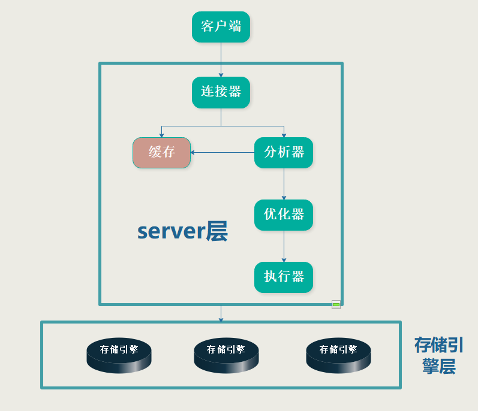

# 1. MySQL的大体架构

大体来说，MySQL 可以分为 **Server 层**和**存储引擎层**两部分。

- Server 层包括连接器、查询缓存、分析器、优化器、执行器等，涵盖 MySQL 的大多数核心服务功能，以及所有的内置函数（如日期、时间、数学和加密函数等），所有跨存储引擎的功能都在这一层实现，比如存储过程、触发器、视图等。

- 存储引擎层负责数据的存储和提取。其架构模式是插件式的，支持 InnoDB、MyISAM、Memory 等多个存储引擎。现在最常用的存储引擎是 InnoDB，它从 MySQL 5.5.5 版本开始成为了默认存储引擎。



# 2. 语句的执行流程

就比如说，我们要执行下面这样一个查询语句
```sql
select * from table where id = 1;
```
大体步骤如下：
1. **建立连接**。也就是说你要先登录。在完成经典的TCP三次握手之后，服务器验证你的身份，然后```获取你所有的操作权限，之后这个连接里的全部操作都将依赖于此时获取到的权限```，这就意味着，一个用户成功建立连接后，即使你用管理员账号对这个用户的权限做了修改，也不会影响已经存在连接的权限。修改完成后，只有再新建的连接才会使用新的权限设置。而如果在连接之后太长时间没有操作，连接也会被重置，这个值默认是8小时，由参数**wait_timeout**控制，单位是分钟。
2. **查询缓存**。查看之前是否执行过该语句，可能以key-value方式存储。如果缓存命中，则可以将结果直接返回给客户端（**首先要权限判断**）。但是大多数情况下不建议使用 缓存，因为缓存失效非常频繁，任何表更新操作都会导致缓存失效，所以缓存命中非常低，得不偿失。如果表是静态表，那么可以尝试缓存。如果将**query_cache_type**设置成**DEMAND**，则可以手动操作是否走缓存。如果没有指定走，那就不走。走缓存的语句如下：

```sql
mysql> select SQL_CACHE * from table where ID=10；
```
**MySQL 8.0 版本直接将查询缓存的整块功能删掉了，也就是说 8.0 开始彻底没有这个功能了。**

4. **语句分析**。词法分析会识别关键词，如字段名、表名等；语法分析会判断语句是否有语法错误。如果语法错误，或者表、列不存在，在这个阶段就会返回。
5. **优化器**。如判断走哪个索引等。在这个阶段，整个语句的执行方案就制定好了，下一步就是执行了。
6. **执行器**：这个阶段首先要做**权限判断**，如果通过了就去执行查询，然后将结果返回


# 3. 补充

## 长连接与短链接
- 长连接是指连接成功后，如果客户端持续有请求，则一直使用同一个连接。
- 短连接则是指每次执行完很少的几次查询就断开连接，下次查询再重新建立一个。

建立连接的过程通常是比较复杂的，所以建议在使用中要尽量减少建立连接的动作，也就是尽量使用长连接。

## 全部使用长连接后MySQL内存占用异常？

这是因为 MySQL 在执行过程中临时使用的内存是管理在连接对象里面的。这些资源会在连接断开的时候才释放。所以如果长连接累积下来，可能导致内存占用太大，被系统强行杀掉（OOM），从现象看就是 MySQL 异常重启了。

**怎么解决这个问题呢？你可以考虑以下两种方案。**

- 定期断开长连接。使用一段时间，或者程序里面判断执行过一个占用内存的大查询后，断开连接，之后要查询再重连。
- 如果你用的是 MySQL 5.7 或更新版本，可以在每次执行一个比较大的操作后，通过执行 **mysql_reset_connection** 来重新初始化连接资源。这个过程不需要重连和重新做权限验证，但是会将连接恢复到刚刚创建完时的状态。